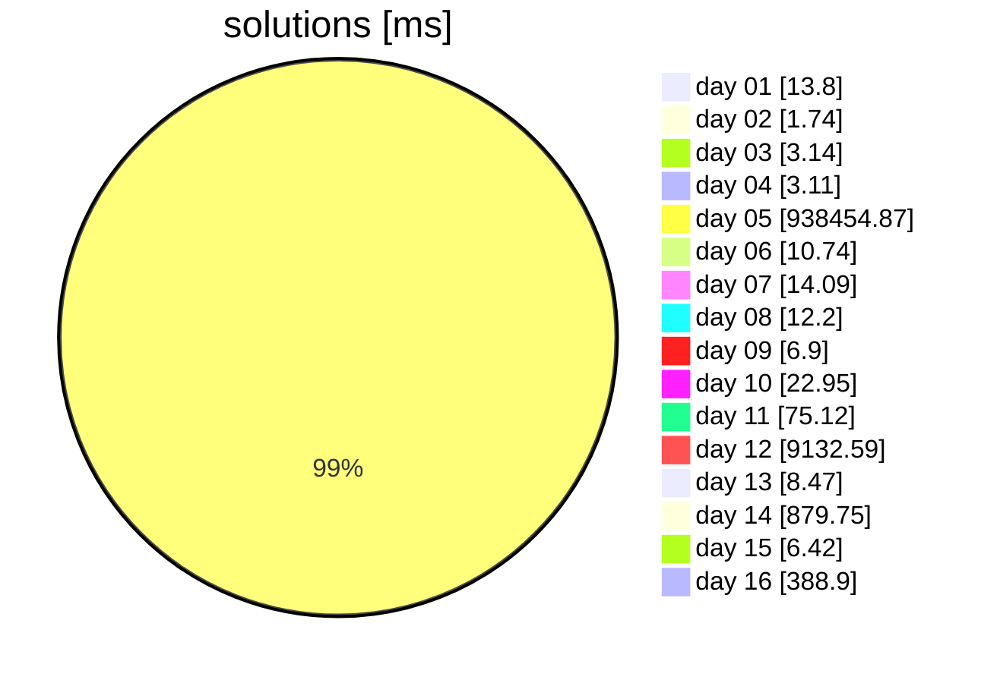

<!-- Entries between SOLUTIONS and RESULTS tags are auto-generated -->

[](https://adventofcode.com/2023)
[](https://nodejs.org/en/download/)

[](https://github.com/caderek/aocrunner)

# 🎄 Advent of Code 2023 🎄

## Solutions

<!--SOLUTIONS-->

[](src/day01)
[](src/day02)
[](src/day03)
[](src/day04)
[](src/day05)
[](src/day06)
[](src/day07)
[](src/day08)
[](src/day09)
[](src/day10)
[](src/day11)
[](src/day12)
[](src/day13)
[](src/day14)
[](src/day15)
[](src/day16)


<!--/SOLUTIONS-->

_Click a badge to go to the specific day._

---

## Installation

```
npm i
```

## Running in dev mode

```
npm start <day>
```

Example:

```
npm start 1
```

---

## Results

<!--RESULTS-->
<details>
<summary>View results</summary>
<br>

```
Day 01
Time part 1: 2.048ms
Time part 2: 11.75ms
Both parts: 13.798ms
```

```
Day 02
Time part 1: 0.608ms
Time part 2: 1.136ms
Both parts: 1.744ms
```

```
Day 03
Time part 1: 2.166ms
Time part 2: 0.969ms
Both parts: 3.136ms
```

```
Day 04
Time part 1: 1.308ms
Time part 2: 1.803ms
Both parts: 3.11ms
```

```
Day 05
Time part 1: 0.375ms
Time part 2: 938454.498ms
Both parts: 938454.872ms
```

```
Day 06
Time part 1: 0.093ms
Time part 2: 10.645ms
Both parts: 10.738ms
```

```
Day 07
Time part 1: 6.813ms
Time part 2: 7.275ms
Both parts: 14.088ms
```

```
Day 08
Time part 1: 2.963ms
Time part 2: 9.24ms
Both parts: 12.202ms
```

```
Day 09
Time part 1: 3.175ms
Time part 2: 3.727ms
Both parts: 6.902ms
```

```
Day 10
Time part 1: 11.622ms
Time part 2: 11.326ms
Both parts: 22.949ms
```

```
Day 11
Time part 1: 12.218ms
Time part 2: 62.899ms
Both parts: 75.117ms
```

```
Day 12
Time part 1: 9132.591ms
Time part 2: -
Both parts: 9132.591ms
```

```
Day 13
Time part 1: 2.691ms
Time part 2: 5.781ms
Both parts: 8.472ms
```

```
Day 14
Time part 1: 6.864ms
Time part 2: 872.886ms
Both parts: 879.75ms
```

```
Day 15
Time part 1: 2.689ms
Time part 2: 3.728ms
Both parts: 6.416ms
```

```
Day 16
Time part 1: 9.491ms
Time part 2: 379.409ms
Both parts: 388.9ms
```

```
Day 17
Time part 1: -
Time part 2: -
Both parts: -
```

```
Day 18
Time part 1: -
Time part 2: -
Both parts: -
```

```
Day 19
Time part 1: -
Time part 2: -
Both parts: -
```

```
Day 20
Time part 1: -
Time part 2: -
Both parts: -
```

```
Day 21
Time part 1: -
Time part 2: -
Both parts: -
```

```
Day 22
Time part 1: -
Time part 2: -
Both parts: -
```

```
Day 23
Time part 1: -
Time part 2: -
Both parts: -
```

```
Day 24
Time part 1: -
Time part 2: -
Both parts: -
```

```
Day 25
Time part 1: -
Time part 2: -
Both parts: -
```

</details>

```
Total stars: 31/50
Total time: 949034.785ms
```



<!--/RESULTS-->

---

✨🎄🎁🎄🎅🎄🎁🎄✨